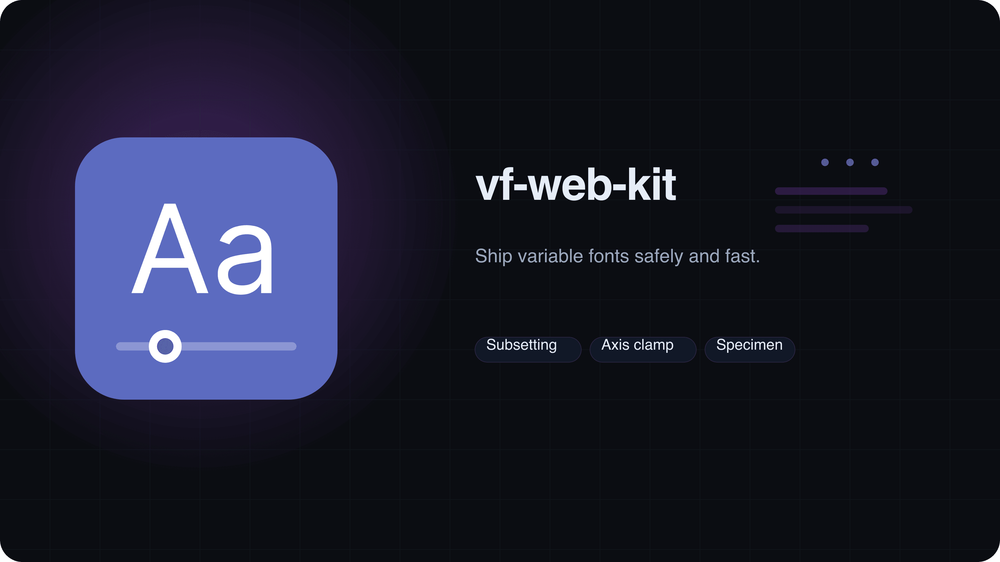
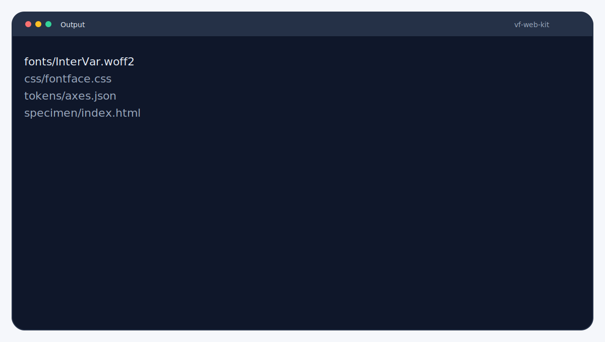
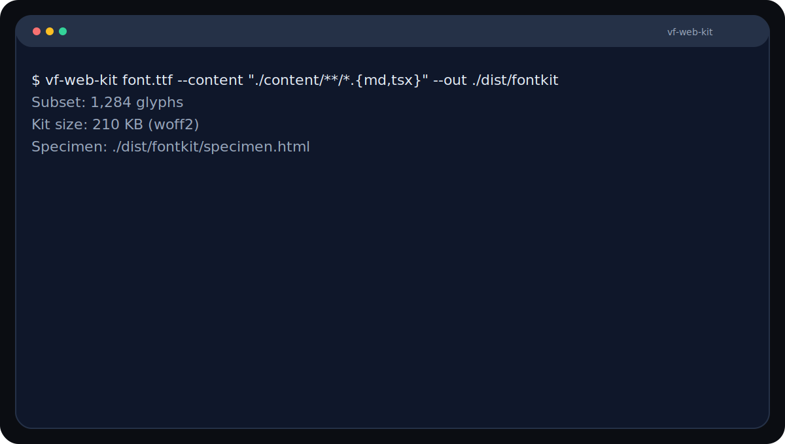

<picture>
  <source srcset="branding/hero.svg" type="image/svg+xml">
  
</picture>

# Variable Font Web Kit
Ship variable fonts safely and fast. Subset glyphs, clamp axes, and ship production-ready kits. Outputs CSS, tokens, and a specimen page for immediate QA.

**Type:** CLI + Library (Node.js)

   

> [!IMPORTANT]
> Provide representative content or strings to avoid missing glyphs in the subset.

## Highlights
- Subsets glyphs and clamps axes safely.
- Outputs production-ready web font kits.
- Includes specimen page for QA.


## Output


Example artifacts live in `examples/`.

Need help? Start with `docs/troubleshooting.md`.

Kit outputs include fonts, CSS, tokens, and a specimen page. See `docs/kit-contents.md`.


## Quickstart
```bash
npx vf-web-kit path/to/font.ttf --content "./content/**/*.{html,md,mdx,tsx}" --out ./dist/fontkit
```


## CI in 60s
```yaml
- name: Build font kit
  run: npx vf-web-kit path/to/font.ttf --content './content/**/*.{md,tsx}' --out ./dist/fontkit
```

## Demo


```bash
vf-web-kit font.woff2 --strings "Hamburgefontsiv 0123456789" --out ./dist/fontkit
```


## Compatibility
- Node.js: 20 (CI on ubuntu-latest).
- OS: Linux in CI; macOS/Windows unverified.
- External deps: none.

## Guarantees & Non-Goals
**Guarantees**
- Outputs a web-ready kit (fonts, CSS, tokens, specimen).
- Deterministic given the same inputs and tool version (metadata may vary).

**Non-Goals**
- Not a full font editor.
- Does not generate new glyphs.

## Docs
- [Requirements](docs/requirements.md)
- [Installation](docs/installation.md)
- [Configuration](docs/configuration.md)
- [Presets](docs/presets.md)
- [Kit Contents](docs/kit-contents.md)
- [Troubleshooting](docs/troubleshooting.md)
- [Guarantees & Non-Goals](docs/guarantees.md)
- [Constraints](docs/constraints.md)
- [Reproducibility](docs/reproducibility.md)

More: [docs/README.md](docs/README.md)

## Examples
See `examples/README.md` for inputs and expected outputs.

## Used By
Open a PR to add your org.


## Contributing
See `CONTRIBUTING.md`.

## License
MIT.
